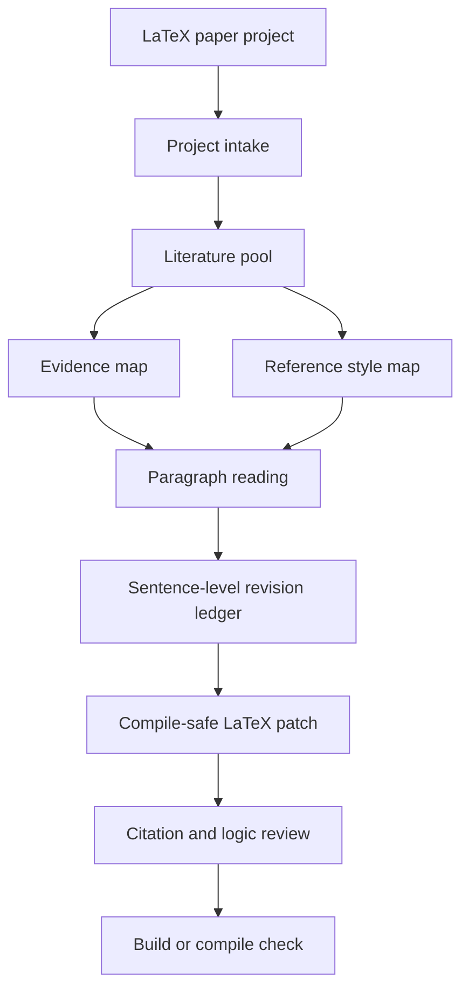

<div align="center">

# Easy-Paper

**An evidence-guided Codex skill for paragraph-by-paragraph LaTeX paper revision**

Turn reference papers into auditable evidence maps, writing patterns, citation slots, and logic checks, then write safe revisions back to your `.tex` manuscript.

[](./SKILL.md)
[](./docs/TEMPLATE_GUIDE.md)
[](./scripts)
[](./LICENSE)

[简体中文](./README.md) | English

</div>

---

## Overview

Easy-Paper is a Codex skill for revising academic papers in LaTeX. It is built for projects where the author has a `.tex` manuscript, a bibliography, and a pool of reference papers or scholarly records. The skill reads the manuscript paragraph by paragraph, builds claim-level evidence maps, gives sentence-level revision comments, checks citations and logic, and applies compile-safe LaTeX edits.

It is not a plagiarism or paraphrasing tool. Reference papers may inform argument structure, rhetorical moves, evidence types, and boundary language. The final manuscript must use the author's own research context, data, methods, and verified sources.

---

## Features

| Feature | What it does |
|---|---|
| LaTeX project intake | Detects `main.tex`, bibliography files, document class, packages, sections, citations, labels, references, and figures |
| Scholarly search | Runs quick OpenAlex and Crossref metadata searches with reproducible output |
| Evidence mapping | Converts literature into supported claims, citation slots, evidence strength, and risk notes |
| Revision ledger | Creates paragraph and sentence-level revision sheets for auditable editing |
| Citation verification | Separates source-existence checks from claim-support checks |
| Template-safe edits | Preserves LaTeX commands, equations, figures, labels, citations, and journal templates |

---

## Architecture



---

## Quick Start

Windows PowerShell:

```powershell
git clone https://github.com/WMar1ng/Easy-Paper.git "$env:USERPROFILE\.codex\skills\easy-paper"
```

macOS / Linux:

```bash
git clone https://github.com/WMar1ng/Easy-Paper.git ~/.codex/skills/easy-paper
```

Restart Codex or open a new task, then invoke:

```text
$easy-paper inspect my LaTeX project and generate a revision ledger
```

Detailed installation instructions are in [docs/INSTALL.md](./docs/INSTALL.md).

---

## Example Prompts

```text
$easy-paper inspect D:\Your\Paper\Project and identify the main .tex file, bibliography style, section tree, citations, labels, figures, and compile command.
```

```text
$easy-paper use my 15 reference papers to build an evidence map, then revise the Introduction paragraph by paragraph. For every sentence, explain the evidence, revision reason, logic check, and remaining risk.
```

```text
$easy-paper search recent high-citation papers on typhoon wave height forecasting and generate candidates for the evidence map and BibTeX file.
```

---

## Academic Integrity

Easy-Paper supports evidence-guided original writing. It does not rewrite other papers sentence by sentence, fabricate citations, import unsupported findings, or help bypass plagiarism checks. See [docs/ACADEMIC_INTEGRITY.md](./docs/ACADEMIC_INTEGRITY.md).

---

## License

MIT License.
