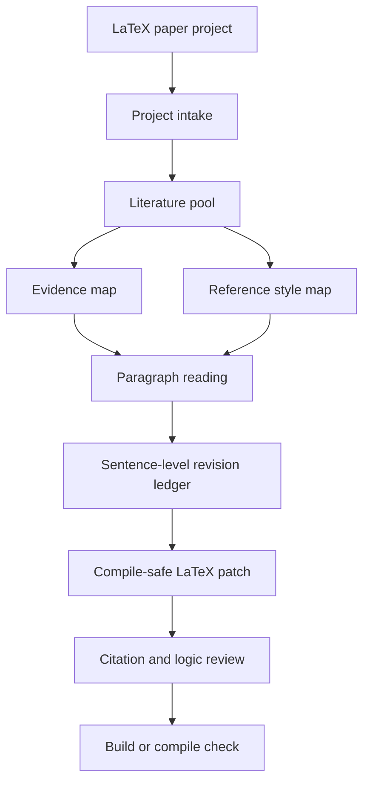

<div align="center">

# Easy-Paper

**面向 LaTeX 论文的证据驱动逐段逐句修订 Skill**

把参考论文转化为可追溯的证据地图、写作范式和逻辑审稿流程，再把修改安全写回你的 `.tex` 主稿。

[](./SKILL.md)
[](./docs/TEMPLATE_GUIDE.md)
[](./scripts)
[](./LICENSE)

简体中文 | [English](./README.en.md)

</div>

---

## 项目概述

Easy-Paper 是一个为 Codex 准备的学术论文写作 skill，核心场景是：你有一篇 LaTeX 论文，也有若干参考论文、BibTeX、DOI、CNKI 导出记录或需要在线检索的高质量文献，希望 AI 能够逐段读取原文、逐句给出修改意见、标注每句话需要哪些证据支持，并最终把可验证、逻辑通顺、表达原创的修改写回 `.tex`。

它不是论文洗稿器。Easy-Paper 不做复制、拼接、近似改写或规避查重的工作。它做的是更稳的那条路：学习参考论文的论证结构，核验文献是否存在，判断文献是否真的支持当前句子，再根据用户自己的研究对象、数据、方法和结果生成原创表述。

---

## 核心能力

| 能力 | 说明 |
|---|---|
| LaTeX 项目接入 | 自动识别 `main.tex`、`references.bib`、文档类、宏包、章节层级、引用键、图片和交叉引用 |
| 文献检索与筛选 | 支持 OpenAlex、Crossref 等开放学术源的快速检索，并保留检索来源与参数 |
| 证据地图 | 将文献转化为 `Supported claim`、`Citation slot`、证据强度和风险，而不是空泛摘要 |
| 逐段逐句修订 | 为每个段落和句子记录问题、参考写作动作、原创改写、逻辑检查和 LaTeX 风险 |
| 引用双重验证 | 区分“文献真实存在”和“文献支持这句话”两个问题 |
| 模板安全写回 | 保留 LaTeX 命令、公式、图表、标签、引用键和期刊模板结构 |

---

## 工作流架构



---

## 项目结构

```text
Easy-Paper/
|-- SKILL.md
|-- README.md
|-- README.en.md
|-- install.ps1
|-- install.sh
|-- agents/
|   `-- openai.yaml
|-- assets/
|   `-- project-template.md
|-- references/
|   |-- evidence-led-revision.md
|   |-- extension-points.md
|   |-- latex-cas-template.md
|   |-- latex-project-intake.md
|   |-- literature-retrieval.md
|   `-- upstream-integration.md
|-- scripts/
|   |-- latex_project_inspect.py
|   |-- latex_revision_sheet.py
|   `-- scholarly_search.py
|-- docs/
|   |-- ACADEMIC_INTEGRITY.md
|   |-- INSTALL.md
|   |-- TEMPLATE_GUIDE.md
|   `-- WORKFLOW.md
`-- examples/
    `-- prompts.md
```

---

## 快速开始

### 方式一：直接克隆到 Codex skills 目录

Windows PowerShell：

```powershell
git clone https://github.com/WMar1ng/Easy-Paper.git "$env:USERPROFILE\.codex\skills\easy-paper"
```

macOS / Linux：

```bash
git clone https://github.com/WMar1ng/Easy-Paper.git ~/.codex/skills/easy-paper
```

然后重新打开 Codex 或开启一个新任务，输入：

```text
$easy-paper 接入我的 LaTeX 论文项目，并先扫描项目结构
```

### 方式二：先克隆，再运行安装脚本

Windows PowerShell：

```powershell
git clone https://github.com/WMar1ng/Easy-Paper.git
cd Easy-Paper
.\install.ps1
```

macOS / Linux：

```bash
git clone https://github.com/WMar1ng/Easy-Paper.git
cd Easy-Paper
bash install.sh
```

更完整的安装、更新和卸载说明见 [docs/INSTALL.md](./docs/INSTALL.md)。

---

## 基本用法

接入 LaTeX 项目：

```text
$easy-paper 接入 D:\Your\Paper\Project，识别 main.tex、references.bib、章节结构和编译命令
```

生成逐段逐句修订账本：

```text
$easy-paper 为 D:\Your\Paper\Project\main.tex 生成 revision-ledger，并先分析 Introduction
```

根据参考论文修订某一节：

```text
$easy-paper 读取我提供的 15 篇参考论文，建立 evidence-map，然后逐段修改 main.tex 的 Introduction。每句话都要说明证据、修改理由和逻辑风险。
```

检索高质量文献：

```text
$easy-paper 围绕 typhoon wave height forecasting 检索近 5 年高引用论文，筛出能支持 Introduction 的 10 篇，并生成 BibTeX 草稿和 evidence-map。
```

---

## 内置脚本

扫描 LaTeX 项目：

```bash
python scripts/latex_project_inspect.py "D:/Your/Paper/Project"
```

生成逐段逐句修订账本：

```bash
python scripts/latex_revision_sheet.py "D:/Your/Paper/Project/main.tex" --output "D:/Your/Paper/Project/plan/revision-ledger.md"
```

快速检索 OpenAlex / Crossref：

```bash
python scripts/scholarly_search.py "typhoon wave height forecasting" --source openalex --limit 20 --year 2020-2026
```

导出 BibTeX 草稿：

```bash
python scripts/scholarly_search.py "VMD LSTM significant wave height forecasting" --source both --limit 10 --format bibtex
```

---

## 支持的论文项目形态

Easy-Paper 默认支持以 `main.tex` 为主稿的 LaTeX 项目，也支持用户手动指定主文件。当前已内置一个 Elsevier CAS 海洋工程论文模板说明，适合类似 `cas-sc`、`natbib`、`cas-model2-names` 的项目。

模板适配说明见 [docs/TEMPLATE_GUIDE.md](./docs/TEMPLATE_GUIDE.md)。

---

## 学术诚信原则

Easy-Paper 可以：

- 学习参考论文的结构、论证顺序和表达策略。
- 判断你的句子需要哪些证据支撑。
- 生成原创改写，并说明为什么这样改。
- 标注引用是否真实、是否支持当前论点。

Easy-Paper 不会：

- 把别人的句子逐句替换成同义句。
- 把参考论文的数据、结论、公式或实验搬进你的论文。
- 编造文献、伪造 DOI 或制造看似真实的引用。
- 帮助绕过查重、审稿或学术规范。

完整边界见 [docs/ACADEMIC_INTEGRITY.md](./docs/ACADEMIC_INTEGRITY.md)。

---

## 灵感来源

Easy-Paper 的流程设计吸收了以下开源项目的思想：

| 项目 | Easy-Paper 借鉴点 |
|---|---|
| [ai-skill-scholar](https://github.com/dsebastien/ai-skill-scholar) | OpenAlex 检索、引用量筛选、两轮文献综述会话 |
| [scientific-agent-skills](https://github.com/K-Dense-AI/scientific-agent-skills) | 多数据库检索选择、API 失败模式、provenance 记录 |
| [OpenDraft](https://github.com/federicodeponte/opendraft) | research -> structure -> compose -> QA -> export 的流水线 |
| [academic-research-skills](https://github.com/Imbad0202/academic-research-skills) | 证据等级、反方审查、伦理与学术诚信门控 |

这些项目是工作流参考，不是复制论文表达的授权。

---

## 贡献

欢迎改进：

- 新期刊或学校 LaTeX 模板；
- CNKI、Zotero、RIS、BibTeX 导入；
- 更强的引用验证；
- 更细的逐句修订账本；
- 更完整的编译检查。

开发说明见 [CONTRIBUTING.md](./CONTRIBUTING.md) 和 [references/extension-points.md](./references/extension-points.md)。

---

## 许可证

本项目使用 [MIT License](./LICENSE)。
